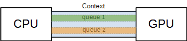
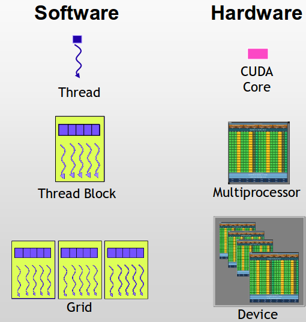
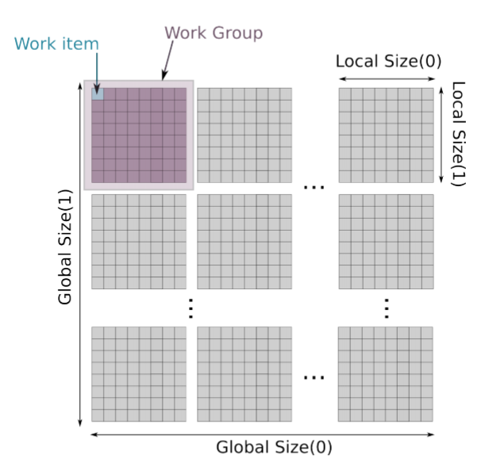

.. raw:: html

   <!-- Patch landslide slides background color --!>
   

1. OpenCL basics
=================

----

OpenCL device, context, queue
------------------------------

* A **device** refers to a target physical device (GPU, multi-core CPU, accelerator)
    * The "parallelized code" is executed on the device
    * The device is controlled by the *host* (CPU)
* The device is tied to the host by one (or several) **context**
* Each context contains a **queue** of instructions
    * Each instruction is "enqueued" in the queue of a context
    * Instructions can be synchronous or asynchronous

.. code-block:: python

    ctx = cl.create_some_context()
    queue = cl.CommandQueue(ctx)
    cl.enqueue_copy(queue, d_myarray, myarray)

.. notes: 
    For this example: simple copy device to host (C convention)
    Encapsulation => OOP friendly
    in PyOpenCL : no "size" provided... book keeping of buffers (np or device)

----

Threads, grid and groups
-------------------------

* A **thread** is a sequence of instructions executed by a computing unit (physical core)
* Threads can be launched by **groups** sharing cached memory
* The total number of launched threads is specified with the **grid**

.. notes:
    CUDA => grid can be up to 3D. OpenCL => no limitation of dimension ("NDRange") in the specification
    in CUDA, the following are specified: n_blocks and n_threads_per_block
    on the Figure, note the row-major format. In CUDA: dimension 0 = x, dimension 1 = y

----

Threads, grid and groups
-------------------------

Before calling an instruction, one has to specify

* The grid size : how many threads will be launched in total
* The work group size : how many threads are grouped

OpenCL kernels
---------------

* A *kernel* is a fundamental function executed by each thread
* All the threads execute the same kernel
    * thread-dependent instructions are specified in the kernel
* The execution order is not deterministic
    * Some synchronization routines (see later)

Some remarks on kernels code :

* A kernel has no return value (``void`` function)
* A kernel cannot call another kernel
* Always check array bounds inside kernels !

.. notes: 
    1: kernels can handle C structs, and even classes in CUDA (maybe OCL 2.x)
    2: preprocessor macros and inline functions
    3: kernels are called with grid size/block size => no check at this stage

----

Our first OpenCL kernel
------------------------

.. code-block:: C

    __kernel void gpu_add(
        __global float* arr1, 
        __global float* arr2, 
        __global float* res, 
        int N) 
    {
        int tid = get_global_id(0); // Thread ID
        if (tid < N) {
            res[tid] = arr1[tid] + arr2[tid];
        }
     }
    
.. notes: No loop ! Faire un dessin

* The kernel codes are identified with the ``__kernel`` prefix
* The ``__global`` prefix indicates that the array is on the device central memory
* In OpenCL, the kernel codes can be provided
    * As a C string (``const char*``)
    * In a separate ``.cl`` file. Recommended for readability !

----

Our first (py)OpenCL kernel launch
-----------------------------------

Now that the kernel is written, it has to be called from the *host*.

.. code-block:: python
    
    import numpy as np
    import os
    import pyopencl as cl
    
    # Create context and queue
    ctx = cl.create_some_context()
    queue = cl.CommandQueue(ctx)
    # Create host and device arrays
    N = 10000
    a = np.arange(N, dtype=np.float32)
    b = np.ones((N,), dtype=np.float32)
    d_a = cl.Buffer(ctx, cl.mem_flags.READ_WRITE, a.nbytes)
    d_b = cl.Buffer(ctx, cl.mem_flags.READ_WRITE, b.nbytes)
    d_res = cl.Buffer(ctx, cl.mem_flags.READ_WRITE, b.nbytes)
    # Copy "a" and "b" on the GPU
    cl.enqueue_copy(queue, d_a, a)
    cl.enqueue_copy(queue, d_b, b)
    # Build and execute the kernel
    kernel_file = os.path.join("opencl", "add.cl")
    kernel_src = open(kernel_file).read()
    program = pyopencl.Program(ctx, kernel_src).build()
    gridsize = (N,)
    groupsize = (1,)
    program.gpu_add(queue, gridsize, groupsize, d_a, d_b, d_res, np.int32(N))
    # retrieve the result from GPU
    res = np.zeros_like(a)
    cl.enqueue_copy(queue, res, d_res)
    
    
----

Launching OpenCL kernels
-------------------------

Standard way to launch a kernel :

* Build the kernel file
    * On-the-fly compilation
* Specify grid size and work group size
* Launch program
    * Watch out arguments types when using Python !

.. notes: if long compilation, build the program at the beginning of the processing

----

Exercises
-----------

1) Write a kernel performing a scalar addition of two arrays.
2) Write the associated host code.
3) Write another kernel multiplying *even indices* of an array by two. Write the associated host code.

----

Multi-dimensional grids
------------------------

* Remember that threads can be grouped to perform a task (*thread work group*)
* All the launched threads belong to the *grid*
* Grid and groups can be *N*-dimensional, hence the name ``NDRange``
    * In practice *N* = 1, 2, 3

Launching a kernel handling a 1D array:

.. code-block:: python

    gridsize = (N,)
    groupsize = (1,)
    program.gpu_add(queue, gridsize, groupsize, d_a, d_b, d_res, np.int32(N))
    
Launching a kernel handling a 2D array:

.. code-block:: python

    gridsize = (Ncols, Nrows) # Mind the convention !
    groupsize = (16, 16)
    program.gpu_add2D(queue, gridsize, groupsize, d_a, d_b, d_res, np.int32(Nr), np.int32(Nc))
    

----

Threads: global and local index
--------------------------------

For given grid and work-group shapes, each threads are indexed with

* The *global index* : position in the grid (``global_id : 0, 1, ..., global_size-1``)
* The *local index* : position in the group (``local_id : 0, 1, ..., local_size-1``)

.. notes: ``local_id`` :math:`\in \; [0, \, \text{local_size}-1]`

.. notes: ``global_id`` :math:`\in \; [0, \, \text{global_size}-1]`

.. code-block:: C

    unsigned int gid0 = get_global_id(0); // 0, ..., get_global_size(0) -1
    unsigned int gid1 = get_global_id(1); // 0, ..., get_global_size(1) -1
    unsigned int lid0 = get_local_id(0); // 0, ..., get_local_size(0) -1
    unsigned int lid1 = get_local_id(1); // 0, ..., get_local_size(1) -1

----

Exercise
---------

1) Write a kernel taking returning a block-matrix containing the values *I+J* where *I*, *J* are the group indices of dimensions 0, 1.

Example for a ``(2, 2)`` work-group size:

.. code-block:: python

    0, 0, 1, 1, 2, 2, ...
    0, 0, 1, 1, 2, 2, ...
    1, 1, 2, 2, 3, 3, ...
    1, 1, 2, 2, 3, 3, ...
    .....................

*You can use* ``get_group_id()`` *or* ``get_global_id()/get_local_size()``

2) Write the associated host code, print the result and try with different work-group sizes.

----

Summary
-------

In this part, the following concepts were highlighted

* Device, host, context, queue
* thread, group, grid
* Kernel : source code executed by a device thread

See also: `Intel - OpenCL basic concepts <https://software.intel.com/sites/landingpage/opencl/optimization-guide/Basic_Concepts.htm>`_

