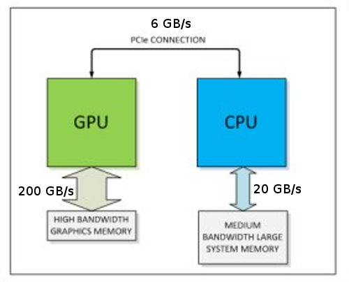
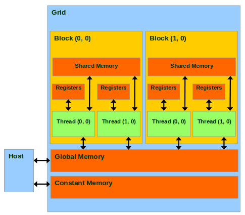
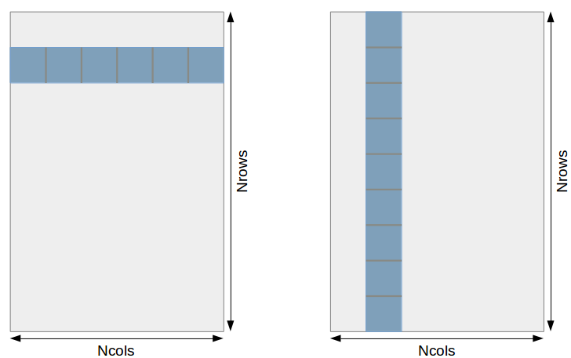
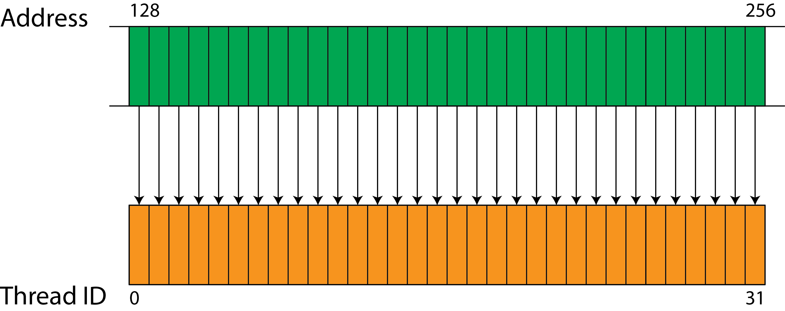
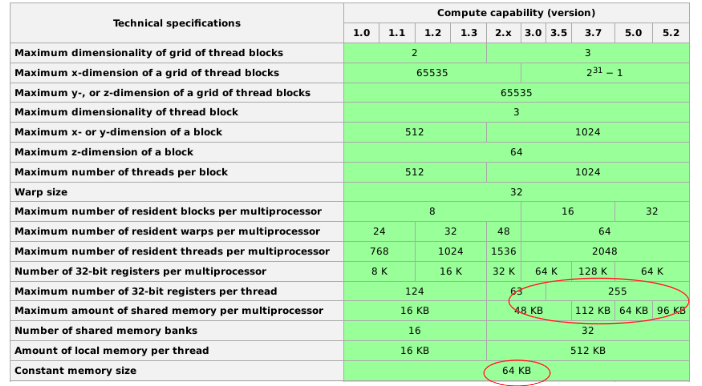

.. raw:: html

   <!-- Patch landslide slides background color --!>
   

2. Accessing memory in GPU computing
======================================

----

Introduction
------------

* Most of the times, performances depend on the way the memory is accessed
* GPUs come with different cache levels

**There is no memory fence mechanism !**

* Reading outside of array bounds often results in nonsense results
* Writing outside of array bounds can corrupt other memory buffers

----

CPU-GPU links
-------------

----

GPU Memory bandwidth
----------------------

Consummer-grade GPUs do not have symmetric bandwidth

* Host->Device is faster than Device->Host
* Device<->Device is much faster
    * When possible, do all the processing on GPU: avoid Host<->Device transfers !

.. code-block:: bash

    GeForce GTX 750 Ti

    Host to Device Bandwidth, 1 Device(s), Paged memory, direct access
       Transfer Size (Bytes)	Bandwidth(MB/s)
       33554432			4499.6
    
    Device to Host Bandwidth, 1 Device(s), Paged memory, direct access
       Transfer Size (Bytes)	Bandwidth(MB/s)
       33554432			5667.1
    
    Device to Device Bandwidth, 1 Device(s)
       Transfer Size (Bytes)	Bandwidth(MB/s)
       33554432			68640.8
    
    
See: ``oclBandwidthTest`` and ``stream_icc`` utilities

----

Cache levels
-------------

+--------------+---------------------+------------------------------+
| Cache level  | Used by             | Typical use                  |
+==============+=====================+==============================+
| Registers    | Registers           | Threads variables            |
+--------------+---------------------+------------------------------+
| L1           | Shared memory       | Workgroup communication      |
+--------------+---------------------+------------------------------+
| L2           | Constant memory     | Look-Up Tables               |
+--------------+---------------------+------------------------------+
| X            | Global memory       | Device arrays                |
+--------------+---------------------+------------------------------+

GPU cache are not intended for the same use as CPU cache

* Cache size/thread is smaller than for CPU
* Typical use: 
    * smoothing out access patterns
    * avoiding memory spill (register -> global mem)

.. notes: see https://www.olcf.ornl.gov/wp-content/uploads/2013/02/GPU_Opt_Fund-CW1.pdf

----

Cache levels: software/hardware view
--------------------------------------

* Registers scope is thread-only
* Shared memory can be accessed from threads of a work-group
* Constant memory can be accessed for any thread

----

Access patterns: warm-up
-------------------------

Consider the following C code. Which loop is the most efficient ?

.. code-block:: C

    // Version 1
    for (int i = 0; i < Nrows; i++) {
        for (int j = 0; j < Ncols; j++) {
            func(arr[i][j]); // read and/or write
        }
    }
    // Version 2
    for (int j = 0; j < Ncols; j++) {
        for (int i = 0; i < Nrows; i++) { 
            func(arr[i][j]); // read and/or write
        }
    }
    

----

Cache lines
-------------

* On CPU and GPU, memory access are cached
* C-like languages (C, C++, OpenCL, CUDA) are row-major. The first version is more efficient.

  

   
* Fast dimension ("line" for row-major languages) <=> fast index (most inner loop)
* Example: On NVidia GPUs, memory is accessed by lines of 128 Bytes (32 elements of 4B)
    * Each load/store actually calls 32 memory transactions
    * This has to be taken into account when accessing memory !

.. notes:

    using column-major
    Took 320.907 ms
    using row-major
    Took 96.228 ms
    
----

Coalesced memory access
------------------------

A memory access is **coalesced** if adjacent threads access to contiguous memory locations.

* This is the optimal memory access pattern for both global and shared memory
* This is not always possible
    * non-coalesced write is worse than non-coalesced read
    * non-coalesced in global memory is worse that non-coaledced in shared memory
* Recent architectures have complex caching mechanisms for global memory
   
   
.. notes: constant memory => cache is automatically done
   

----

Example of coalesced memory access
-----------------------------------

.. code-block:: C

    // ...
    unsigned int gidx = get_global_id(0); // fast dim
    unsigned int gidy = get_global_id(1);
    unsigned int gidz = get_global_id(2); // slow dim

    if (gidy < VOL_H && gidx < VOL_W && gidz < VOL_Z) {

        float val = input[(gidz*IMAGE_H + gidy)*IMAGE_W + gidx]; // input[z][y][x]
        // ...

----

Memory is a resource...
-------------------------

Example for Nvidia GPUs:

See `<https://en.wikipedia.org/wiki/CUDA>`_

