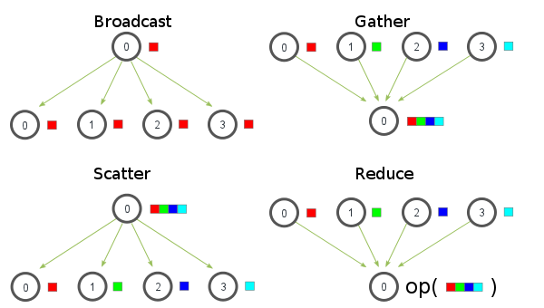
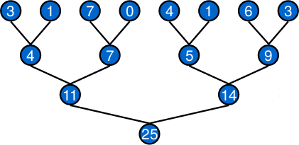

.. raw:: html

   <!-- Patch landslide slides background color --!>
   

3. Parallel patterns
=====================

----

Introduction
-------------

In our case, common memory access patterns are

* Element-wise
* Scatter
* Gather
* Reduction

   

* Other patterns: compact, map, scan, partition

.. notes: compact/expand ; map/reduce ; scan (eg. cumsum)
.. notes: https://stanford-cs193g-sp2010.googlecode.com/svn/trunk/lectures/lecture_6/parallel_patterns_1.pdf
.. notes: http://www.cs.nyu.edu/courses/fall10/G22.2945-001/slides/lect10.pdf
.. notes: https://people.cs.uct.ac.za/~jgain/lectures/Algorithms.pdf

----

Element-wise access
--------------------

* Each thread access to one memory location
* There is an "obvious" one-to-one thread-memory map (preferably coalesced)
* "Embarrassingly parallel"

----

Exercices
----------

1) Write a kernel performing the sum of two 2D ``float`` arrays.

2) Write a kernel performing the flat-field correction of an image.

----

Example: flat-field correction
-------------------------------

.. code-block:: C

    __kernel void flatfield(
        __global float* image, 
        __global float* dark,
        __global float* flat, 
        int Nr, 
        int Nc)
    {
    	float data;
    	int i = get_global_id(0);
        int j = get_global_id(1);
        int idx = i*Nc + j;
    	if(i < Nr && j < Nc) {
    	   data -= dark[i];
    	   data /= flat[i];
    	}
    }

----

Scatter/Gather 
---------------

* Gather: read multiple data items to a single location 
* Scatter: write a single data item to multiple locations 

Gather with special access pattern (eg. convolution) is sometimes called *stencil*

Read/write issues

* If different threads read from the same memory location, the access are *serialized*, slowing down the process.
* If different threads write to the same memory location, *behavior is unpredictable*. 

----

Atomic operations
------------------

* Making different threads write to the same memory location results in a conflict.
* Solution: **atomic operations**, i.e operations that cannot be interrupted

.. code-block:: C
    
    int atomic_add (int *p, int val)
    int atomic_inc(int *p)
    

**Note**: there is no atomic operations on ``float`` for OpenCL 1.x implementations !

----

Exercices
----------

1) Write a kernel performing a 2x2 binning of an image (its dimensions are assumed to be even).

2) Write a kernel performing the 256-bins histogram of an image of dynamic range [0, 255].

----

Reduction
----------

* Accumulate elements with a given operator (+, -, ``*``, ...)
* Examples: sum the elements of an array, dot product
    * Trivial task in sequential programming
    * Not-so-easy in parallel programming

**Parallel reduction** : multi-pass elementary gathers

   
* Mind threads synchronization !

----

Reduction: example
-------------------

.. code-block:: C

    // ... 
    unsigned int lid = get_local_id(0);
    // smem is a pointer to shared memory ; the work-group size is 128
    if (lid < 64) smem[lid] += smem[lid+64];
    barrier(CLK_LOCAL_MEM_FENCE);
    if (lid < 32) smem[lid] += smem[lid+32];
    barrier(CLK_LOCAL_MEM_FENCE);
    if (lid < 16) smem[lid] += smem[lid+16];
    barrier(CLK_LOCAL_MEM_FENCE);
    if (lid < 8) smem[lid] += smem[lid+8];
    barrier(CLK_LOCAL_MEM_FENCE);
    if (lid < 4) smem[lid] += smem[lid+4];
    barrier(CLK_LOCAL_MEM_FENCE);
    if (lid < 2) smem[lid] += smem[lid+2];
    barrier(CLK_LOCAL_MEM_FENCE);
    if (lid == 0) smem[0] += smem[1];
    barrier(CLK_LOCAL_MEM_FENCE);
    // ...
    

----
    
Reduction
----------

Common pattern: two-stage reductions

* Pass 1: reduce on the array : *(N1, N2)* -> *(W1, W2)* where *W* is the work-group size
* Pass 2: reduce on the *(W1, W2)* array

Also allows for map-reduce algorithms (see for example `simultaneous min/max <https://github.com/kif/sift_pyocl/blob/master/openCL/reductions.cl>`_)

Look around first before writing your own reductions !

* clblas/cublas : many highly-optimized reductions (``asum``, ``nrm2``, ``dot``, ...) with error-reduction schemes
* pyopencl comes with various `built-in reductions <https://documen.tician.de/pyopencl/algorithm.html#module-pyopencl.reduction>`_

----

Conclusion
-----------

Take-home messages

    * Non-negligible algorithmic work to write efficient parallel code
    * On discrete GPUs, avoid Device<->Host transfers when possible
    * Profile your code !

The following points were not addressed:

    * Texture memory (another cached memory)
    * Other interesting patterns like scan and map-reduce

Where to go from here:

    * `pyopencl examples <https://github.com/pyopencl/pyopencl/tree/master/examples>`_
    * `pyopencl tutorials <https://documen.tician.de/pyopencl/#tutorials>`_

