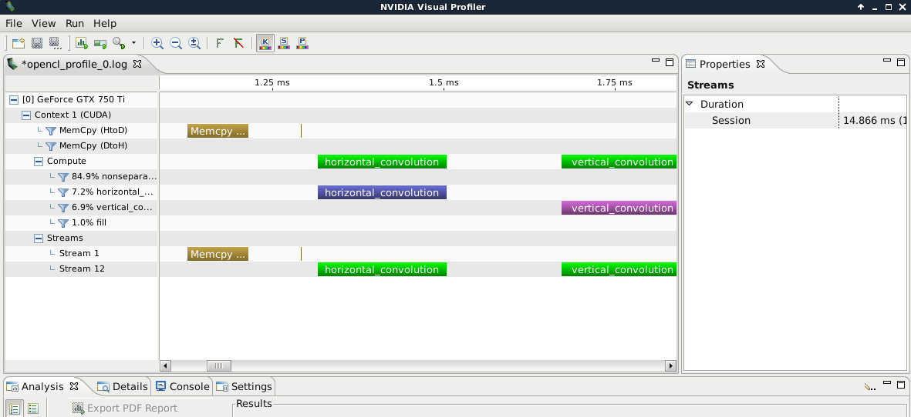

.. raw:: html

   <!-- Patch landslide slides background color --!>
   

4. Profiling
=============

----

Introduction
-------------

* Performances are often linked to memory access and bandwidth
* Recent GPU have complex caching mechanisms
* Bottlenecks are not-so-obvious, possibly platform-dependent

Here we give two examples of profiling tools :

* OpenCL profiling mode
* NVidia visual profiler

----

OpenCL profiling mode
----------------------

* OpenCL provides a profiling mode for a given queue
* An ``event`` is assigned to each program

.. code-block:: C

    ctx = cl.create_some_context()
    queue = cl.CommandQueue(ctx, properties=cl.command_queue_properties.PROFILING_ENABLE)
    prg = cl.Program(self.ctx, src).build()
    exec_evt = prg.sum(queue, global_size, local_size, a_buf, b_buf, dest_buf)
    exec_evt.wait()
    elapsed = 1e-9*(exec_evt.profile.end - exec_evt.profile.start)
    print("Execution time of test: %g s" % elapsed)
    
 
* The time resolution is ``1 ns``
* Mind ``exec_evt.wait()`` before calling ``exec_evt.profile``
    * This is a blocking call
    * Advanced event-based synchronization are available with event wait lists

.. notes: http://sa09.idav.ucdavis.edu/docs/SA09-opencl-dg-events-stream.pdf

Example : `<https://github.com/pyopencl/pyopencl/blob/master/examples/benchmark.py>`_

----

Exercise
---------

Profile execution time for a separable convolution *versus* a non-separable convolution.

----

NVidia Visual Profiler
-----------------------

NVidia provides a visual profiler :

.. code-block:: bash

    nvvp &

Unfortunately, Nvidia's Visual Profiler (nvvp) used to work for profiling OpenCL (even through pyopenCL) but Nvidia stopped updating it.

----

NVidia Visual Profiler with (py)OpenCL
----------------------------------------

A workaround is proposed in `this SO answer <http://stackoverflow.com/questions/29068229/is-there-a-way-to-profile-an-opencl-or-a-pyopencl-program/35016313#35016313>`_.

1) Create a ``nvvp.cfg`` file containing the profiling informations :

.. code-block:: bash

    profilelogformat CSV
    streamid
    gpustarttimestamp
    gpuendtimestamp
    gridsize
    threadblocksize
    dynsmemperblock
    stasmemperblock
    regperthread
    memtransfersize
    

2) Create a script exporting the environment variables and calling your program

.. code-block:: bash

    #!/bin/bash
    export {CL_,COMPUTE_}PROFILE=1
    export COMPUTE_PROFILE_CONFIG=nvvp.cfg
    python OpenCL_test.py
    

3) Execute this script. This will generate an output log like ``opencl_profile_0.log``

----

NVidia Visual Profiler with (py)OpenCL (2)
--------------------------------------------

4) In this file, replace all the occurence of ``OPENCL_`` with ``CUDA_`` :

.. code-block:: bash

    sed -i.bak s/OPENCL_/CUDA_/g opencl_profile_0.log

5) Open this modified file with ``nvvp``

